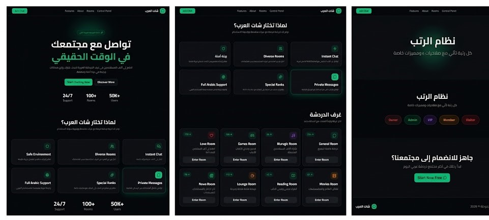
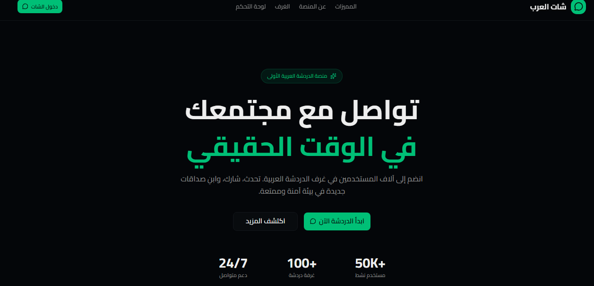
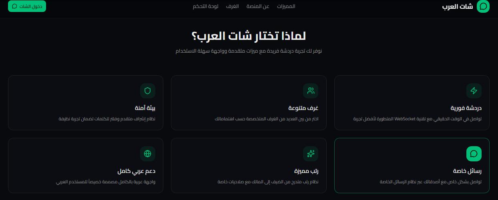
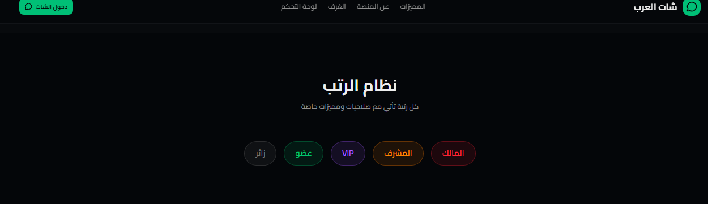
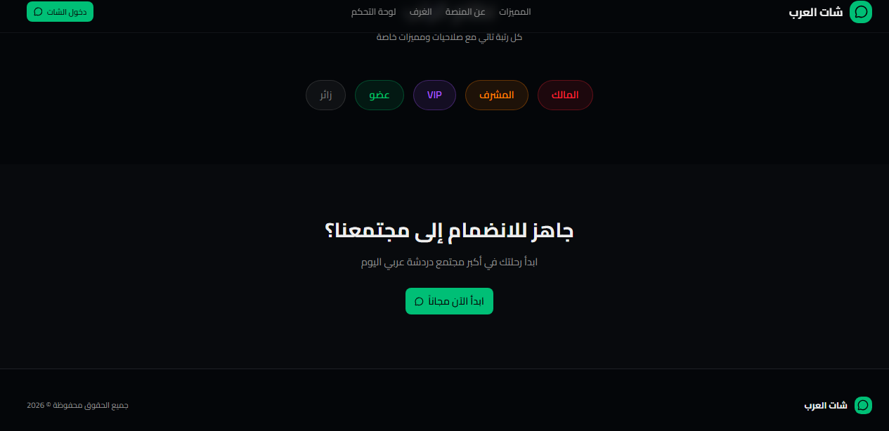
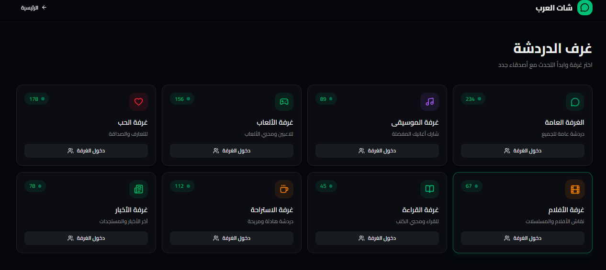

# شات العرب (Arabic Chat UI) 💬

[English Version Below](#english-version)

## 📌 نظرة عامة
**شات العرب** هو قالب متكامل لواجهة مستخدم لمنصة دردشة حية (Live Chat) مصممة خصيصاً للمجتمع العربي. يوفر القالب واجهة عصرية وسلسة لتطبيقات الدردشة التي تعتمد على غرف المحادثة العامة (Chat Rooms) والرسائل الخاصة، بالإضافة إلى نظام رتب متدرج للمستخدمين. تم تصميم القالب لدعم اللغة العربية بالكامل (RTL) بشكل افتراضي، مما يضمن تجربة مستخدم مثالية.

## 🚀 المميزات الرئيسية
- **دعم كامل للغة العربية (RTL):** جميع المكونات والواجهات مصممة خصيصاً من اليمين لليسار.
- **غرف دردشة متعددة (Chat Rooms):** واجهة مجهزة لدعم الانتقال بين غرف دردشة مختلفة بناءً على الاهتمامات أو المواضيع.
- **الرسائل الخاصة المباشرة (Direct Messages):** تصميم يدعم نظام المحادثات الخاصة الآمنة بين المستخدمين.
- **نظام الرتب والصلاحيات (Role-based System):** شارات (Badges) وألوان مخصصة لكل رتبة (مالك، مشرف، VIP، عضو، زائر).
- **التوافق مع WebSockets:** مكونات الواجهة مهيأة للعمل الفوري مع تقنيات الدردشة الحية (Real-time) مثل Socket.io، لضمان تحديث الرسائل دون الحاجة لتحديث الصفحة.
- **صفحة هبوط جذابة (Landing Page):** واجهة تعريفية للمنصة تبرز الميزات وتشجع الزوار على الانضمام.

## 🛠️ التقنيات المستخدمة (Tech Stack)
- **إطار العمل:** Next.js 14+ (App Router) & React 19
- **لغة البرمجة:** TypeScript
- **التصميم وتنسيق الواجهات:** Tailwind CSS v4
- **مكونات واجهة المستخدم:** Radix UI / Shadcn UI

## ⚙️ طريقة التشغيل (Getting Started)
لتشغيل المشروع محلياً:

1. **تثبيت الحزم (Dependencies):**
# Arabic Chat UI — واجهة محادثة عربية

> قالب واجهة دردشة عربية احترافي مبني بـ Next.js + React + TailwindCSS مع دعم RTL.

---

## 📸 معاينة المشروع







---

```bash
npm install
# أو باستخدام pnpm
pnpm install
```

2. **تشغيل خادم التطوير (Development Server):**
```bash
npm run dev
# أو باستخدام pnpm
pnpm dev
```

3. **معاينة المشروع:**
افتح الرابط [http://localhost:3000](http://localhost:3000) في متصفحك.

---

<a name="english-version"></a>
# Arabic Chat UI 💬

## 📌 Overview
**Arabic Chat UI** is a complete user interface template for a live chat platform designed specifically for the Arab community. The template provides a modern and smooth interface for chat applications that rely on public chat rooms and private messaging, along with a hierarchical role system for users. The template is designed to fully support Arabic (RTL) by default, ensuring a perfect user experience.

## 🚀 Key Features
- **Full Arabic (RTL) Support:** All components and interfaces are specifically designed from right to left.
- **Multiple Chat Rooms:** Interface ready to support switching between different chat rooms based on interests or topics.
- **Direct Messages:** Design supports secure private conversation systems between users.
- **Role-based System:** Dedicated badges and colors for each role (Owner, Admin, VIP, Member, Guest).
- **WebSocket Compatibility:** UI components are optimized to work instantly with real-time chat technologies like Socket.io.
- **Engaging Landing Page:** An introductory interface for the platform that highlights features and encourages visitors to join.

## 🛠️ Tech Stack
- **Framework:** Next.js 14+ (App Router) & React 19
- **Language:** TypeScript
- **Styling:** Tailwind CSS v4
- **UI Components:** Radix UI / Shadcn UI

## ⚙️ Getting Started
To run the project locally:

1. **Install dependencies:**
```bash
npm install
# or using pnpm
pnpm install
```

2. **Run the development server:**
```bash
npm run dev
# or using pnpm
pnpm dev
```

3. **View the project:**
Open [http://localhost:3000](http://localhost:3000) in your browser.
